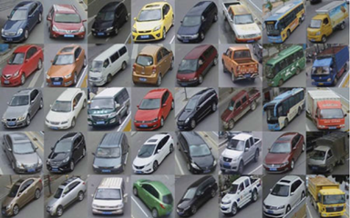
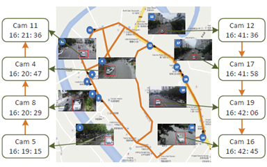

# 1. VeRi dataset ([**THE NEW WEBPAGE**](http://vehiclereid.github.io/VeRidataset/))
To facilitate the research of vehicle re-identification (Re-Id), we build a large-scale benchmark dateset for vehicle Re-Id in the real-world urban surveillance scenario, named "VeRi". The featured properties of VeRi include:
* It contains over 50,000 images of 776 vehicles captured by 20 cameras covering an 1.0 km^2 area in 24 hours, which makes the dataset scalable enough for vehicle Re-Id and other related research. 
* The images are captured in a real-world unconstrained surveillance scene and labeled with varied attributes, e.g. BBoxes, types, colors, and brands. So complicated models can be learnt and evaluated for vehicle Re-Id.
* Each vehicle is captured by 2 ∼ 18 cameras in different viewpoints, illuminations, resolutions, and occlusions, which provides high recurrence rate for vehicle Re-Id in practical surveillance environment.
* It is also labeled with sufficient license plates and spatiotemporal information, such as the BBoxes of plates, plate strings, the timestamps of vehicles, and the distances between neighbouring cameras.

&ensp;&ensp;&ensp;&ensp;&ensp;&ensp;

# 2. Download
To encourage related research, we will provide the dataset according to your request. 
Please email your full name and affiliation to the contact person (*xinchenliu at bupt dot edu dot cn*). 
We ask for your information only to make sure the dataset is used for non-commercial purposes. 
We will not give it to any third party or publish it publicly anywhere.

# 3. Citation
If you use the dataset, please kindly cite the following paper:
* Xinchen Liu, Wu Liu, Tao Mei, Huadong Ma: A Deep Learning-Based Approach to Progressive Vehicle Re-identification for Urban Surveillance. ECCV (2) 2016: 869-884
* Xinchen Liu, Wu Liu, Tao Mei, Huadong Ma: PROVID: Progressive and Multimodal Vehicle Reidentification for Large-Scale Urban Surveillance. IEEE Trans. Multimedia 20(3): 645-658 (2018)

# 4. Example codes
Here we give an example code for vehicle search evaluation.

In this code, we should first get the distance matrix of all query images and test images.
As in the example code, we have three distance matrixes obtained with SIFT-BOW, CN-BOW, CNN features seperately.
Then these matrixes are summed with different weights to obtain the final "dist" matrix.

Then we read the ground truth and junk image index (the test images that have the same camera ID with the query image, they are not considered when computing the AP) from the gt_image.txt and jk_image.txt.

After that, for each query, we rank the distance to each test image and compute the Average Presicion using the compute_AP function.
At last, we can obtain the mAP, HIT@1, HIT@5, and the CMC curves.

The model and distance files can be downloaded from [BaiduPan](https://pan.baidu.com/s/1gYBNQI0_MZLB0ANW8qnYGw) [GoogleDrive](https://drive.google.com/open?id=0B0o1ZxGs_oVZWmtFdXpqTGl3WUU).

# 5. State-of-the-art Results on the VeRi Dataset

|Reference|Year|        Rank-1|        Rank-5|           mAP|
|:-------:|:--:|-------------:|-------------:|-------------:|
|1|2016|19.92|59.65|75.27|
|2|2016|27.77|61.44|78.78|
|3|2017|58.27|83.49|90.04|
|4|2017|57.4|86.59|92.85|
|5|2017|51.42|-|-|
|6|2017|33.78|60.19|77.4|
|7|2017|60.47|85.52|95.11|
|8|2018|53.42|81.56|95.11|
|9|2018|59.47|**96.24**|**98.97**|
|10|2018|61.5|88.6|94|
|11|2018|53.53|82.9|91.6|
|12|2018|61.32|85.92|91.84|
|13|2018|53.45|83.49|92.55|
|14|2018|61.11|89.27|94.76|
|15|2018|53.35|82.06|92.31|
|16|2018|49.3|88.56|-|
|17|2018|64.78|88.62|94.52|
|18|2018|25.12|60.83|78.55|
|19|2018|60.49|77.33|88.27|
|20|2019|62.62|90.58|97.14|
|21|2019|57.44|84.39|94.05|
|22|2019|**67.55**|90.23|96.42|
|23|2019|61.83|88.5|94.46|

## Reference
[1] Liu, Xinchen, et al. "Large-scale vehicle re-identification in urban surveillance videos." ICME 2016.

[2] Liu, Xinchen, et al. "A deep learning-based approach to progressive vehicle re-identification for urban surveillance." ECCV 2016.

[3] Liu, Wu, et al. "Beyond human-level license plate super-resolution with progressive vehicle search and domain priori GAN." ACMMM 2017.

[4] Shen, Yantao, et al. "Learning deep neural networks for vehicle re-id with visual-spatio-temporal path proposals." ICCV 2017.

[5] Zhang, Yiheng, Dong Liu, and Zheng-Jun Zha. "Improving triplet-wise training of convolutional neural network for vehicle re-identification." ICME 2017.

[6] Wang, Zhongdao, et al. "Orientation invariant feature embedding and spatial temporal regularization for vehicle re-identification." ICCV 2017.

[7] Tang, Yi, et al. "Multi-modal metric learning for vehicle re-identification in traffic surveillance environment." ICIP 2017.

[8] Liu, Xinchen, et al. "PROVID: Progressive and multimodal vehicle reidentification for large-scale urban surveillance." IEEE TMM 20.3 (2018): 645-658.

[9] Bai, Yan, et al. "Group-Sensitive Triplet Embedding for Vehicle Reidentification." IEEE TMM 20.9 (2018): 2385-2399.

[10] Liu, Xiaobin, et al. "Ram: a region-aware deep model for vehicle re-identification." ICME 2018.

[11] Zhu, Jianqing, et al. "Joint feature and similarity deep learning for vehicle re-identification." IEEE Access 6 (2018): 43724-43731.

[12] Zhou, Yi, and Ling Shao. "Aware attentive multi-view inference for vehicle re-identification." CVPR 2018.

[13] Zhu, Jianqing, et al. "A shortly and densely connected convolutional neural network for vehicle re-identification." ICPR 2018.

[14] Jiang, Na, et al. "Multi-Attribute Driven Vehicle Re-Identification with Spatial-Temporal Re-Ranking." ICIP 2018.

[15] Wu, Chih-Wei, et al. "Vehicle re-identification with the space-time prior." CVPRW 2018.

[16] Kanaci, Aytac, Xiatian Zhu, and Shaogang Gong. "Vehicle Re-Identification in Context." arXiv preprint arXiv:1809.09409(2018).

[17] Wu, Fangyu, et al. "Joint Semi-supervised Learning and Re-ranking for Vehicle Re-identification." ICPR 2018.

[18] Zhou, Yi, Li Liu, and Ling Shao. "Vehicle re-identification by deep hidden multi-view inference." IEEE TIP 27.7 (2018): 3275-3287.

[19] Zhou, Yi, and Ling Shao. "Vehicle Re-Identification by Adversarial Bi-Directional LSTM Network." WACV 2018.

[20] Liu, Xinchen, et al. "PVSS: A Progressive Vehicle Search System for Video Surveillance Networks." arXiv preprint arXiv:1901.03062 (2019).

[21] Lou, Yihang, et al. "Embedding Adversarial Learning for Vehicle Re-Identification." IEEE TIP (2019).

[22] Kumar, Ratnesh, et al. "Vehicle Re-Identification: an Efficient Baseline Using Triplet Embedding." arXiv preprint arXiv:1901.01015 (2019).

[23] Zhu, Jianqing, et al. "Vehicle Re-Identification Using Quadruple Directional Deep Learning Features." IEEE TITS (2019).

